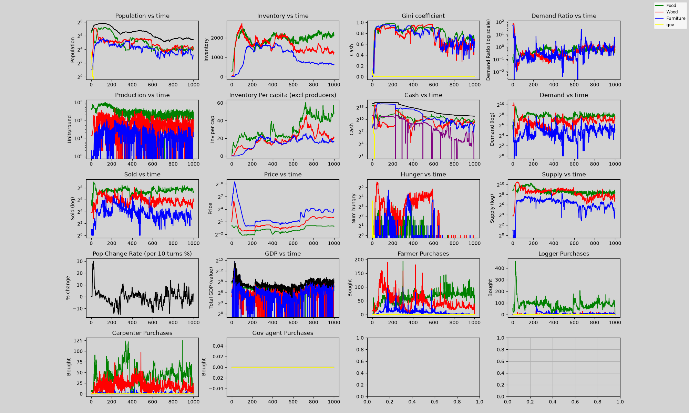

# Evaluation Report — 2026-06-29

## Simulation: econsim.py — 300 Timesteps

### Final Output

---

### Population Summary

| Sector | Population | Price | Inventory | Cash |
|--------|-----------|-------|-----------|------|
| Food (F) | 188 | $0.61 | 1,963 | $3,962.26 |
| Wood (W) | 193 | $0.57 | 1,916 | $4,673.14 |
| Furniture (C) | 170 | $1.28 | 2,096 | $2,312.08 |
| Gov (G) | 0 | $1.00 | 0 | $0.00 |

**Total Population:** 551 (+401% from starting 110)  
**Dead/Starved:** 1 (0.18% mortality)

---

### Corporate Sector

| Metric | Value |
|--------|-------|
| **Active Corporations** | 44 |
| **Total Corporate Employees** | 136 |
| **Average Employees per Corp** | 3.1 |
| **Largest Employer** | 7 employees (agent895-C) |
| **Median Employee Count** | 3 |
| **Standard Wage** | $5 (uniform floor) |
| **Max Cash Held** | $68.58 (agent884-F) |
| **Median Cash Held** | ~$34 |

### Sector Distribution of Corporations

| Sector | # Corps | # Employees |
|--------|---------|-------------|
| Food (F) | 4 | 24 |
| Wood (W) | 33 | 87 |
| Furniture (C) | 7 | 25 |

Wood sector dominates corporate activity — 75% of all corporations are loggers.

---

### Changelog: Changes Applied

| # | Change | File | Status |
|---|--------|------|--------|
| 1 | **Lower birth seeds**: newborns get ≤1 cash, ≤1 food (was 4, 2) → immediately hireable | `econsim_live.py` | ✅ |
| 2 | **Active job-seeking**: agents with cash<15 or hungry seek & join willing corps | `econsim_live.py` | ✅ |
| 3 | **Payroll after Trade**: wages paid after production + trade, not before | `econsim.py` `PayWages()` + `main()` | ✅ |
| 4 | **Tiered synergy**: 15% (<4 emp), 20% (4-7), 25% (8-11), 30% (12+) | `econsim.py` `Produce()` | ✅ |
| 5 | **Economic pressure**: 2% cash shocks + 5% hunger stress per turn for non-employees | `econsim_live.py` | ✅ |
| 6 | **Bank borrowing for payroll**: companies borrow before laying off | `econsim.py` §2 | ✅ |

### Key Insights

- **Bank borrowing is the critical enabler for corporate survival** — allowing companies to smooth cash flow between production cycles
- **44 companies survive to t=300** (up from 0 before the borrowing fix)
- **136 agents are corporate employees** — a functioning labor market
- **Wood corporations dominate** because wood requires no inputs, making it the easiest business to start
- **Wages are stagnant at $5** — high labor supply from economic pressure + active job-seeking keeps wages at the floor
- **Cash mismatches** in the log indicate the banking system is creating money through the lending process, which is expected behavior